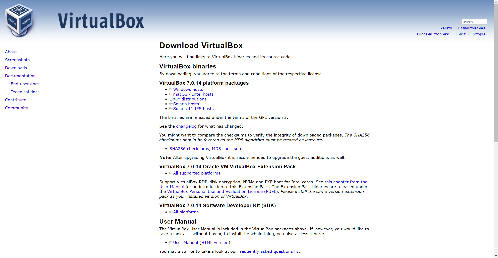
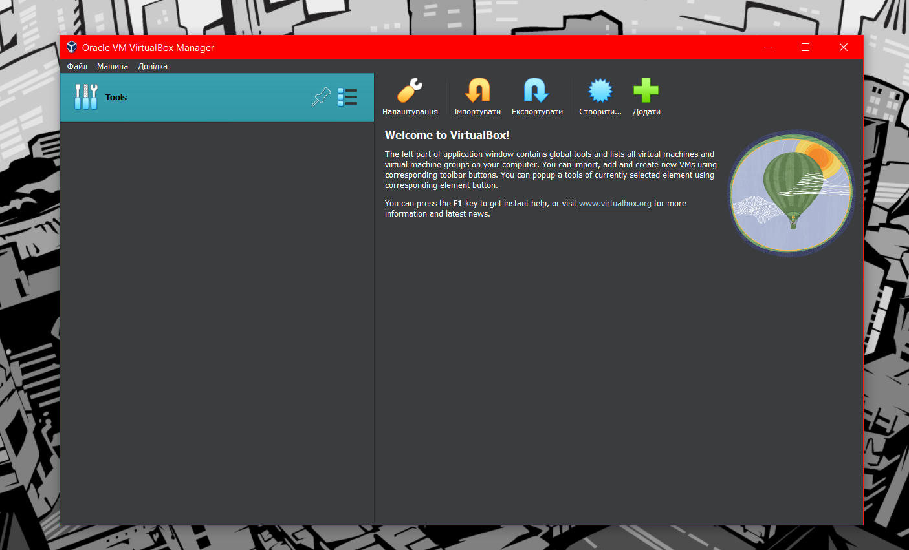
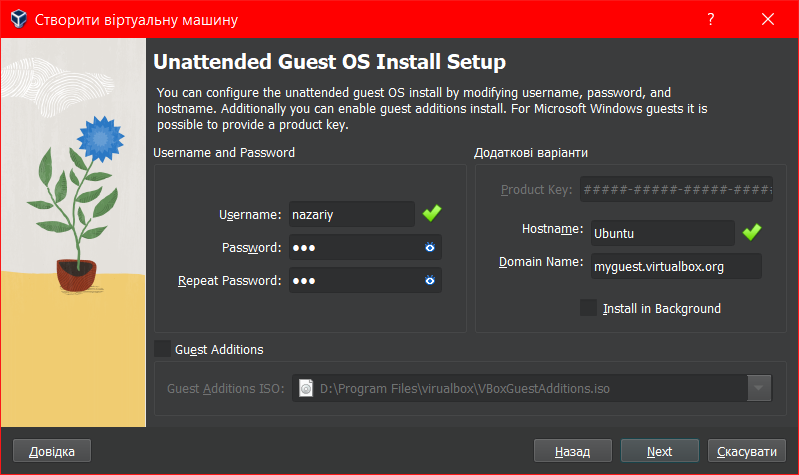
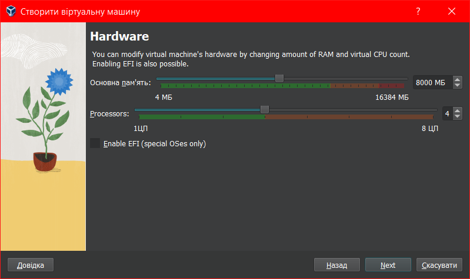
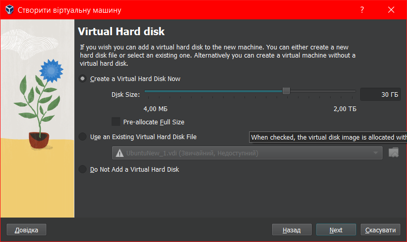
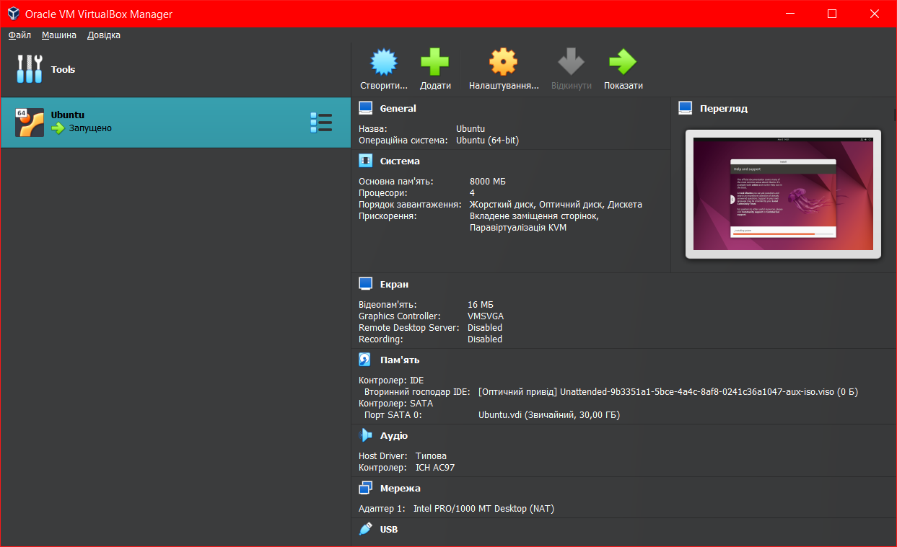
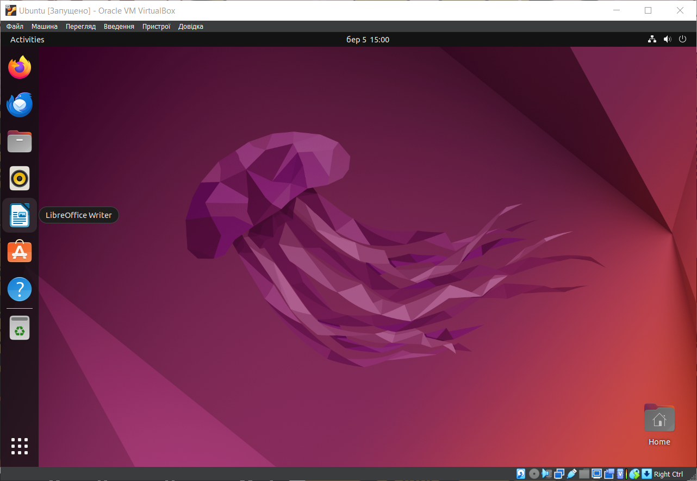

# Ubuntu on Windows installation guide
## 1. Download an Ubuntu image
You can download an Ubuntu image [here](https://ubuntu.com/download/desktop).

## 2. Download and install VirtualBox
You can download VirtualBox from the downloads page [here](https://www.virtualbox.org/wiki/Downloads).

Once you have completed the installation, go ahead and run VirtualBox.

## 3. Create a new virtual machine
Click **New** to create a new virtual machine. Fill in the appropriate details.

## 4. Create a user profile

## 5. Define the Virtual Machine’s resources
In the next section we can specifiy how much of our host machine’s memory and processors the virtual machine can use. For good performance it’s recommended to provide your VM with around 8GB of RAM (althought 4GB will still be usable) and 4 CPUs. Try to remain in the green areas of each slider to prevent issues with your machine running both the VM and the host OS.

Then we need to specify the size of the hard disc for the virtual machine. For Ubuntu we recommend around 25 GB as a minimum. By default the hard disk will scale dynamically as more memory is required up to the defined limit. If you want to pre-allocate the full amount, check the ‘Pre-allocate Full Size’ check box. This will improve performance but may take up unnecessary space.

Click **Next** to continue and view a summary of your machine setting.

After this click **Finish** to initialize the machine!

## 6. Install your image
Click **Start** to launch the virtual machine.

### Congratulations!